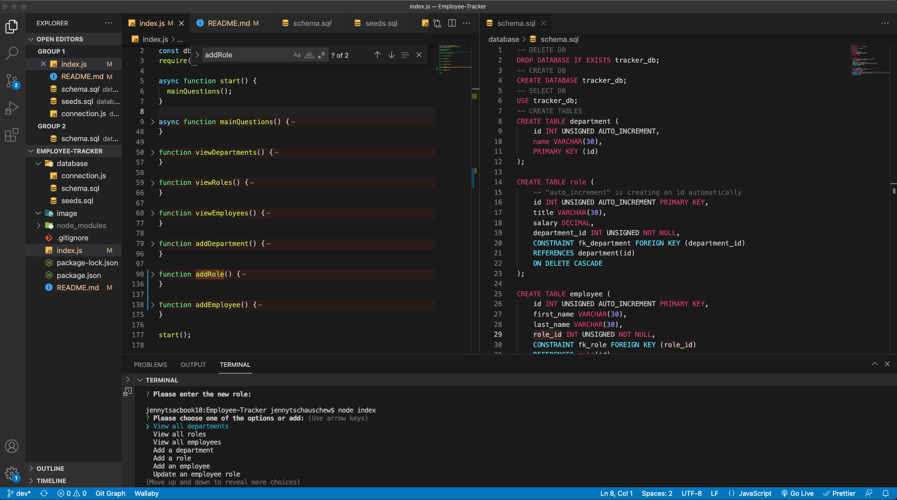

# 12 SQL: Employee-Tracker

Table of content

- [12 SQL: Employee-Tracker](#12-sql-employee-tracker)
- [Description](#description)
- [Building Structure](#building-structure)
- [Screenshots](#screenshots)
- [Tech/Framwork used](#techframwork-used)
- [Repositery content + link](#repositery-content--link)

# Description

This application allows - for example an HR team - to list and track different employee data and roles, their salary and their affiliation in the respective departments. Using mySQL as an open source database application and the node.js inquirer package the user can start the application via the command line to view and add data of/to the database/application. Different questions, such as "View all departments", "View all roles" and "Add a department" are giving the structure of the application. The user has even the option to update the already insert information.

# Building Structure

The very first thing is the set-up of the database structure of tracker_db (schema.sql) - besides downloading mysql. Three different tables - department, role and employee - are allowing to store and to connect (PRIMARY KEY and FOREIGN KEY) the tables with each other. The first data is provided by the seed.sql file. The automatic call of the mySQL account is ensured by the connection.js file.

The node.js command line application by using the inquirer package is place within the index.js file. All the command line questions and selection options are stored and coded in several functions.

The console.table method displays tabular data as a table in the terminal when it has been called.

# Screenshots

# Tech/Framwork used

- Node.js
- npm packages: require
- console.table
- JavaScript
- mySQL

# Repositery content + link

- database
  - connection.js
  - schema.sql
  - seeds.sql
- image
  - 1-Screenshot.png
- node_modules
  - ...
- .gitignore
- index.js
- package-lock.json
- package.json
- README.md

- GitHub (dev branch): https://github.com/JenBerlin/Employee-Tracker/pull/1
- Walkthrough-Video: https://drive.google.com/file/d/14cqFpcQAvYcv-W4kQOxrLgCLGUOHPzO4/view?usp=sharing
